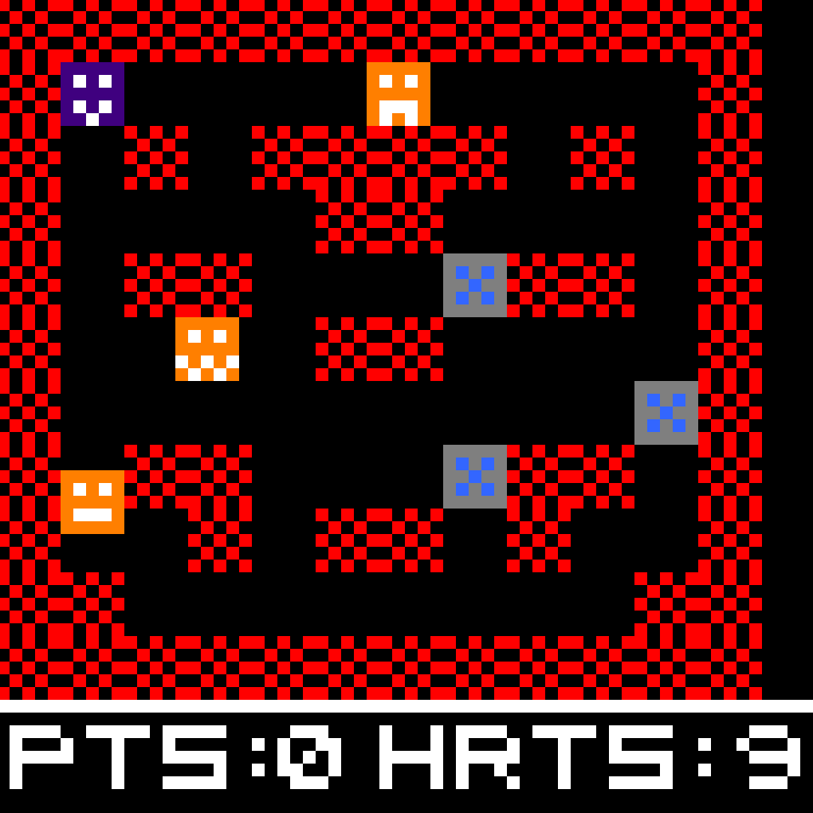

# The MacGuffin Hunter! Ruchira-Nimmagadda CS0447

## Overview

MacGuffin Hunter is an interactive game developed in MIPS assembly using the MARS simulator. The game features a player-controlled character navigating a structured arena to collect MacGuffins while avoiding enemies. The objective is to collect as many MacGuffins as possible before running out of lives.

## Game Mechanics
### Game Arena
- The game is played on a 64x64 pixel MARS LED display.
- The game updates dynamically, handling collision detection, scorekeeping, and enemy AI.
- The arena is divided into two sections: The Top Area and Bottom Area
- Top Area: The main game area where the player moves and interacts with MacGuffins and enemies.
- Bottom Area: Displays the player's score and remaining lives.
- The game world consists of walls and empty spaces, with MacGuffins initially placed in all empty spaces.

### Player
- The player moves through empty spaces using keyboard inputs.
- The player collects MacGuffins by moving onto them.
- The player starts with a set number of lives and loses one upon collision with an enemy.
- After losing a life, the player temporarily becomes invincible, blinking to indicate invulnerability.

### MacGuffins
- MacGuffins are scattered throughout the game arena in non-wall tiles.
- The player gains points by collecting MacGuffins.
- Enemies can also collect MacGuffins, reducing the available score for the player.
- MacGuffins are animated for visual effect.

### Enemies
- Three enemies spawn in the arena at the start of the game.
- Enemies move automatically and aim to capture MacGuffins or chase the player.
- Enemies actively chase the player, changing direction at intersections or obstacles to minimize distance.
- If an enemy collides with the player, the player loses a life.

### Game End Conditions
- The game ends when: All MacGuffins are collected or the player runs out of lives.

### Implementation Details
- The game logic is structured into: Model, View, Control.
- Model: Tracks player/enemy positions, score, and arena state.
- View: Handles rendering on the LED display.
- Control: Processes player inputs and updates game state. 

